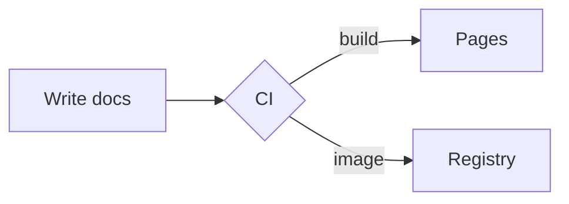

# Showcase

A tour of the formatting available in this template. Hover any abbreviation like
HTML or CSS to see the tooltip (defined once in `docs/includes/abbreviations.md`
and reused via a Markdown include).

## Admonitions

!!! note
    Use admonitions to call out information.

!!! warning "Heads up"
    Warnings draw the eye.

??? tip "Collapsible details"
    This block is collapsed by default.

## Syntax highlighting

Fenced code blocks are highlighted with line numbers and a copy button.

```python title="hello.py" linenums="1"
def greet(name: str) -> str:
    """Return a friendly greeting."""
    return f"Hello, {name}!"


print(greet("world"))
```

```go
package main

import "fmt"

func main() {
    fmt.Println("Hello, world!")
}
```

Inline code highlighting also works: `#!python sorted([3, 1, 2])`.

## Content tabs

=== "uv"

    ```bash
    uv run zensical serve
    ```

=== "Docker"

    ```bash
    docker run --rm -p 8000:8000 -v ${PWD}:/docs zensical/zensical serve -a 0.0.0.0:8000
    ```

## Card grid

<div class="grid cards" markdown>

-   :material-language-markdown: **Markdown-first**

    ---

    Write plain Markdown; Zensical handles the rest.

-   :material-source-branch: **Versioned**

    ---

    `just version::bump` and `just version::tag` cut releases.

</div>

## Diagrams



## Math

Inline: $f(x) = x^2$. Block:

$$
\sum_{k=1}^{n} k = \frac{n(n+1)}{2}
$$

## Markdown includes

Reuse shared snippets across pages with `pymdownx.snippets`:

```text
--8<-- "includes/abbreviations.md"
```

--8<-- "includes/abbreviations.md"
